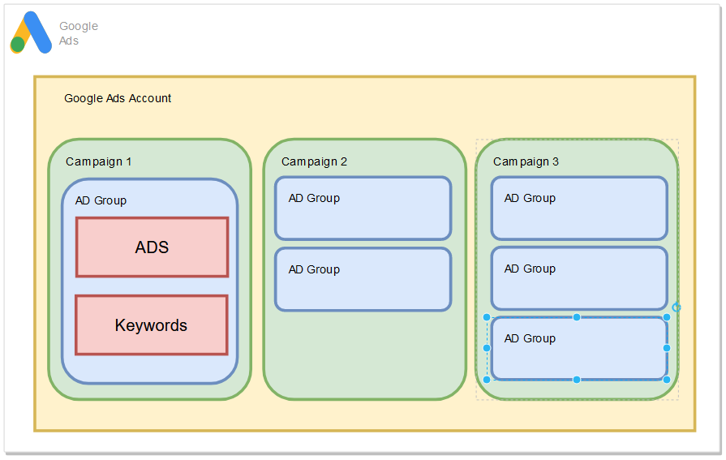

# Introduction

Google is the major player on the search field, it dominates about 75% of search market share.

Google offers paid advertisements which appear in search results on google.com with the use of Google Ads or advertisements that appear on other websites through the Display Network and Google’s AdSense program.

## Creating Google Ads Account
---

To create the google adds access the following link and clicks in `sign in`:

- [`Google Ads`](https://ads.google.com/home/)

### Skip the guided setup ! Otherwise the major features will not be visible.

## Account Hierarchy
---

- `Account Level` - Contains general configuration like: email, timezone, billing settings, user access. Contains many compaigns.

- `Campaing` - Responsible by: Location Targeting, Ad Schedule, Device Targeting, Audience. Contains many ad groups.

- `Ad Group` - Contains many ads and keywords, it is possible to configure targets, ads rotation etc.

- `Ads` - Ad showed on Google.

- `Keywords` - Resposible mediator between a ad been showed or not based on the search term.

## Concepts
---

- `Search Term` - What the user types on Google.