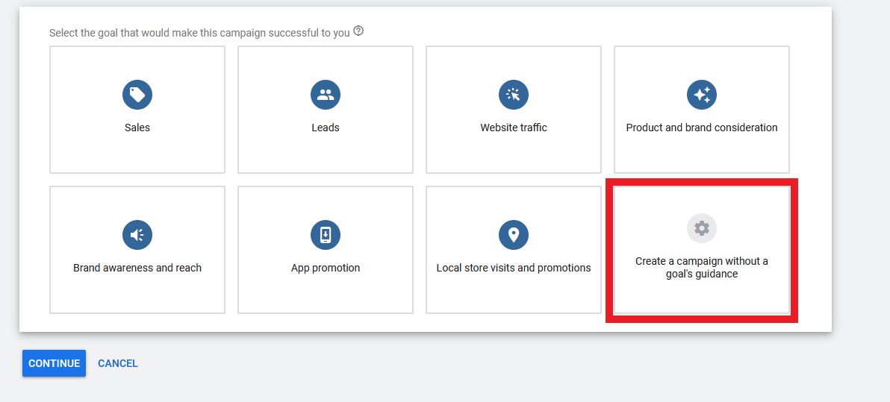
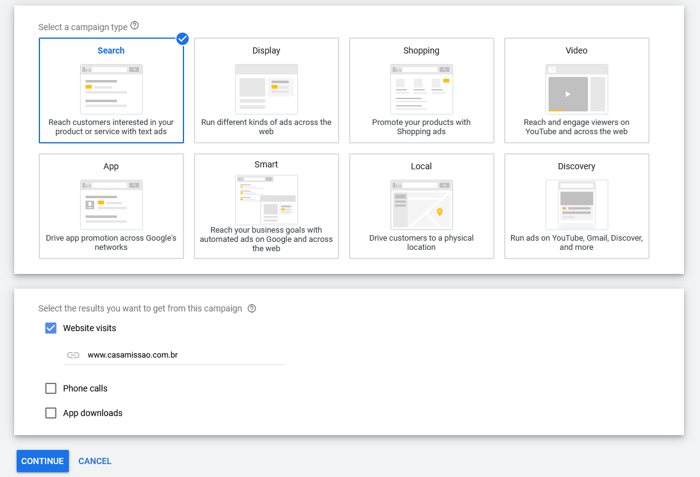

# Campaign

On Google Ads a `Campaign` is a set of one or more ad groups (ads, keywords, and bids) that share a budget, location targeting, and other settings. Campaigns are typically used to organize categories of products or services offered by an advertiser.

## Creating a Campaign
---

On Google Ads Page click on the button `+ New Campaign`, a good advice is create a campaign without a `goal's guidance` to get a full control on the settings and customizations.

It is a good practice to following a standard when naming a compaign like: `Store Name` - `Topic` - `Location`

 - CM - Produtos Naturais - Itu

## Network Settings
---

`Display Network` - Show ads on external or non-search engine pages like blogs, shopping pages etc.

- The first thing to do is `deselect` the `Display Network` (show ads on shopping section, blobs etc), because showing an ads without a intent of search is not profitable and has low convertion rates. Not based on keywords.

`Search Network` - Show ads on google partners like: Youtube, Amazon, CNN, Ask.com, Google Maps, about.com and so on.

- A good advice is to `deselect` this option also, since the conversion rates is lower, there is not a official list of patterns and you do not know where your ads will aper.

## Location Targeting
---

Location targeting defines where geographically your ad will aper.

Will can Basic exclusions targeting by:

- `Country`
- `Region`
- `City`
- `PostalCode`
- `Radius` 
- `Pin Mode` - Just select an area on map and define a radius, could not exclude location on Pin Mode.

### Advanced Location Options

`Target` - On target you have the following options:

- `Presence or Interest` - Your add will be shown if the person is in the location or the search term is in the location: "Theater in New York".

- `Presence` - Your add just will be shown if the person is in the location.

- `Search Interest` - People searching for your target locations (physical presence of the user is totally ignored).

`Exclude` - On exclude there are the following options:

- `Presence`: People in your excluded locations

- `Presence or Interest` - People in, or who`ve shown interest in your excluded locations.

## Languages
---

Language targeting allows you to restrict where your ads can appear based on the user's language settings and the language of the site. (Google does not translate your ads)

Google takes in account the user interface to perform this decision, like user preference settings and google domain ( google.com / google.com.br )

## Budget
---

On google ads you set daily budget, so this is a configuration which you tell google the maximum you are willing to pay per day for this campaign.

However, google ensures that will not pay more than 30x(daily budget) but it can spend up to 2x(daily budget) in specifics days (if it feels that you can get more impressions).

There is no right answer to define how much your daily budget should be. The rule of thumb is the profit.

**If your bucket is less than $20 dollars do not put more than 2-3 keywords.**